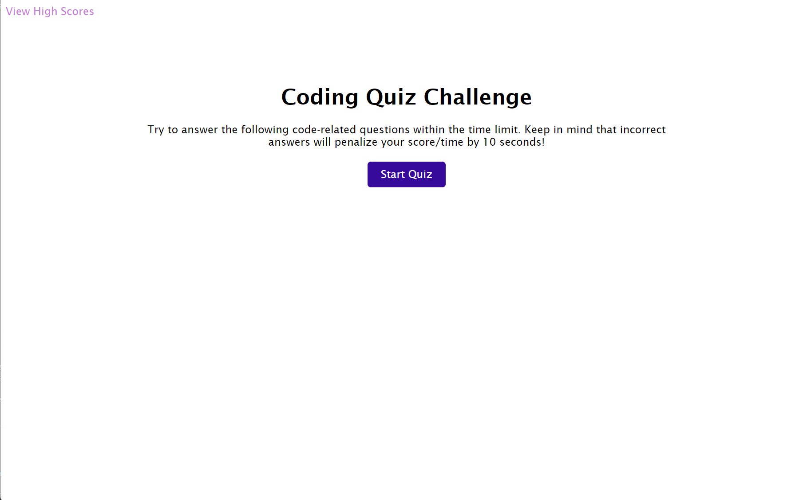
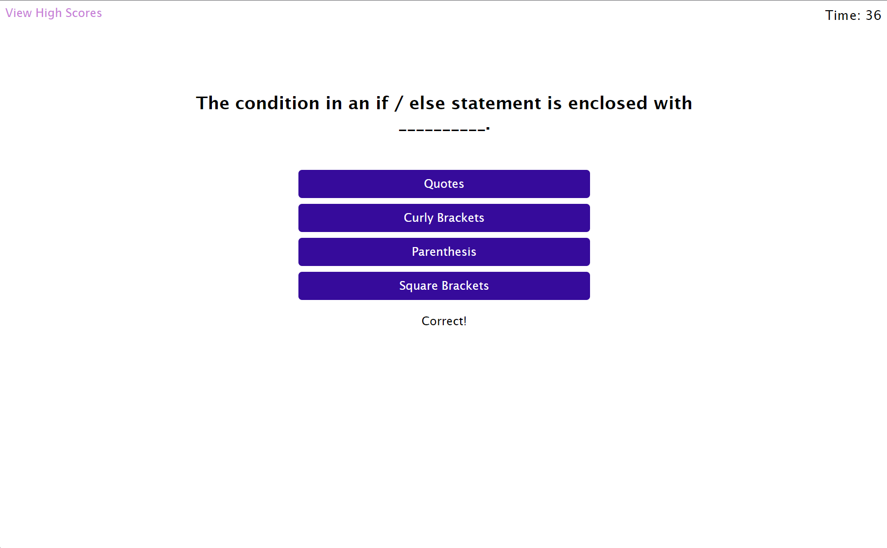
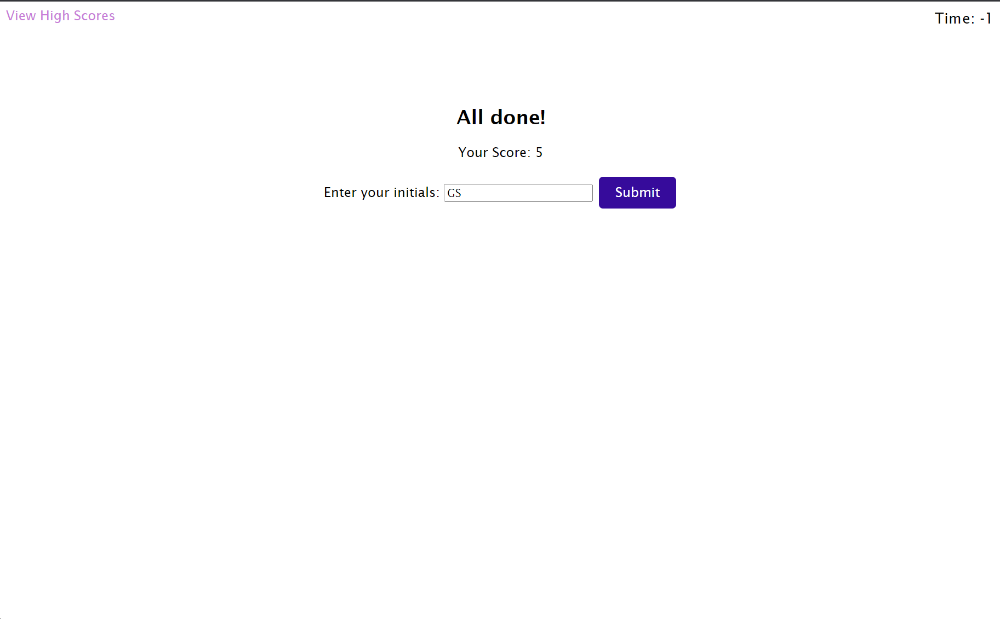
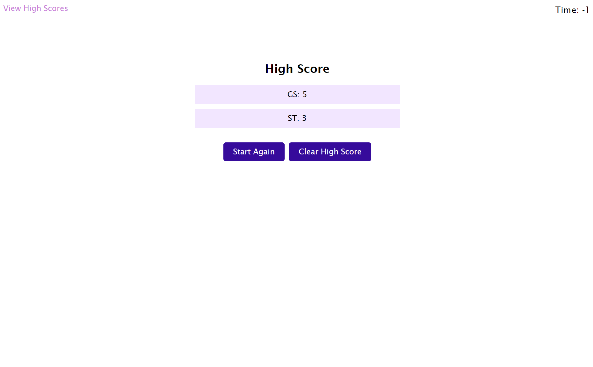

# JavaScript Coding Quiz

## Table of Contents
- [Description](#description)
- [Features](#features)
- [Usage](#usage)
- [Screenshots](#screenshots)
- [License](#license)

## Description

This is a JavaScript coding quiz designed for coding boot camp students. It provides a timed quiz on JavaScript fundamentals and stores high scores for comparison with peers.

## Features

- Multiple-choice quiz questions on JavaScript fundamentals
- Timer that counts down during the quiz
- Penalty for incorrect answers, subtracting 10 seconds from the timer
- High scores are stored and can be viewed at any time
- Ability to submit initials to save and track high scores

## Usage

To use the JavaScript Coding Quiz:

1. The application is deployed and you can access it by clicking on [This Link](https://www.example.com)
3. Click the "Start Quiz" button to begin the quiz.
4. Read each question and select your answer by clicking on the choice buttons.
5. If your answer is correct, you will see a "Correct!" message. If your answer is wrong, you will see a "Wrong!" message, and 10 seconds will be deducted from the timer.
6. The quiz ends when all questions are answered or when the timer reaches 0.
7. After the quiz, enter your initials in the input field and click "Submit" to save your score.
8. Click the "View High Scores" link to see the list of high scores.
9. To clear the high scores, click the "Clear High Scores" button.

## Screenshots

## License

This project is licensed under the [MIT License](LICENSE).

---